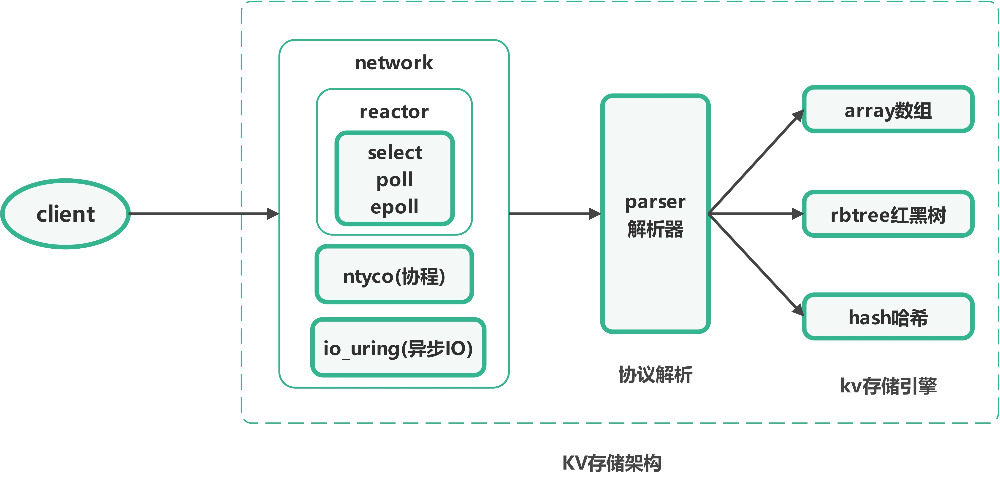
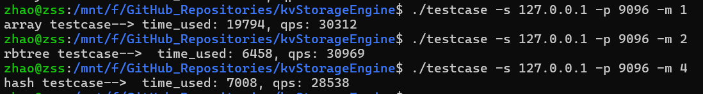

# kvStorageEngine

## 项目介绍

本项目旨在设计并实现了一个基于 Linux 操作系统，使用多线程和高效网络通信协议（如 TCP 协议、Reactor 模式、异步 I / O 等）的高性能 KV 存储引擎，最终可以将项目打包输出一个供外部系统调用的库或 SDK，并且支持 Go、Java、Python、Node.js 和 Rust 多种编程语言。

## KV 存储引擎架构图

## KV 存储引擎代码逻辑架构图

## 客户端 & 服务端 协议格式

| 客户端发送的数据格式 |    kv 引擎回复的数据格式     |
| :------------------: | :--------------------------: |
|    SET Key Value     |      SUCCESS 或 FAILED       |
|       GET Key        |      Value 或 NO EXIST       |
|    MOD Key Value     | ERROR 或 SUCCESS 或 NO EXIST |
|       DEL Key        | ERROR 或 SUCCESS 或 NO EXIST |

  

## 性能测试

### 该项目性能测试步骤

+ 测试网络层 IO 并发量
+ 高并发下的 QPS 和系统吞吐量
+ 每一个业务场景都有对应 testcase

### 业务开发过程中的 testcase

  + SET Name King
  + GET Name
  + MOD Name Job
  + GET Name
  + DEL Name
  + GET Name

### 服务器配置信息

+ 服务器：阿里云
+ CPU：2 核

+ 内存：2 GiB
+ 系统：Ubuntu 22.04
+ 公网带宽：100 Mbps(峰值)

### qps 测试的 bash 语句

服务端：

~~~bash
$ make clean
$ make
$ ./kvstore
~~~

客户端：

~~~bash
# 为了方便，代码中为每个存储引擎结构定义了一个开关；
# 1 是 数组； 2 是红黑树；4 是哈希
$ ./testcase -s 127.0.0.1 -p 9096 -m 1  
~~~

### 性能测试结果

+ 网络层 IO 并发量可以达到近百万；

+ 使用数组存储引擎，执行 10w 次，每次 6 条，相当于是 60 万次，qps 是 22150

+ 使用红黑树存储引擎，执行 5w 次，每次 4 条，相当于是 20 万次，qps 是 22276

+ 使用哈希存储引擎，执行 5w 次，每次 4 条，相当于是 20 万次，qps 是 20153

【注意】存储引擎性能通常会受到多种因素的影响，包括硬件配置、网络环境、负载类型以及具体实现的效率。如果服务器配置更好，性能会更优。因本人条件有限，只能使用这个免费的服务器，后续会进行优化。可以继续优化哈希函数来提高性能，将来也可以引入更多的数据结构来作为存储引擎~

## 性能测试【升级版】

由于服务器配置比较低，测的 qps 并没有那么高，突然想到服务器本身就相当于一台电脑。我本地的电脑配置要比之前用的服务器，虚拟机等要高得多，我就在想能不能用自己的电脑运行该程序。最后经过测试，大功告成了。步骤如下：

1. 安装 WSL

   可以参考该文章：[WSL 介绍 & 安装 & 使用 & 高性能本地服务器【详细教程】](https://blog.csdn.net/zss6666yi/article/details/140907430?spm=1001.2014.3001.5502)

2. 使用 WSL 进行测试，结果如下：

   + 网络层 IO 并发量可以达到近百万；
   
   
      + 使用数组存储引擎，执行 10w 次，每次 6 条，相当于是 60 万次，qps 是 **30312**
   
   
      + 使用红黑树存储引擎，执行 5w 次，每次 4 条，相当于是 20 万次，qps 是 **30969**
   
   
      + 使用哈希存储引擎，执行 5w 次，每次 4 条，相当于是 20 万次，qps 是 **28538**
   
        
   

由上述结果可知，随着设备与网络等条件的优化，确实可以提高该 kv 存储引擎的性能~

## Git 常用命令

参考这篇博客：[【最新 & 持续更新】使用 Git 和 GitHub 进行版本控制和协作开发 | 上传个人代码 | 增删改查](https://blog.csdn.net/zss6666yi/article/details/140879769?spm=1001.2014.3001.5502)

