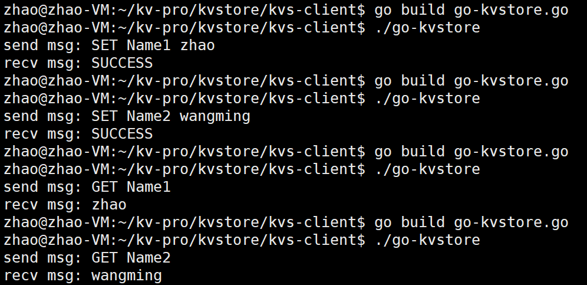
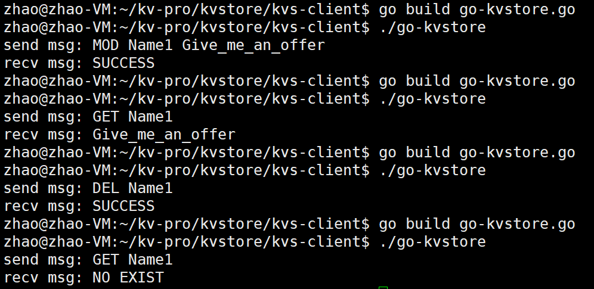
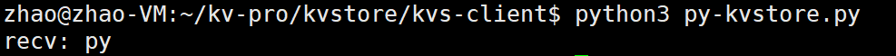
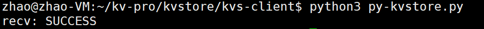
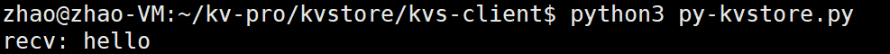
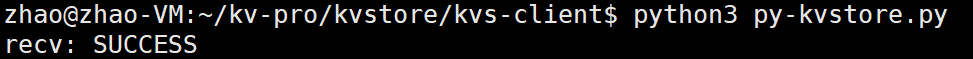
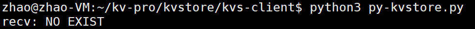

# kvStorageEngine

## 项目介绍

本项目旨在设计并实现一个高性能的 KV 存储引擎。通过底层高效的数据结构和算法、丰富的 API 接口、以及协程和 TCP 协议，打造一个能够支持高并发、低延迟的数据存储解决方案。最终可以将项目打包成一个库或 SDK，支持多种编程语言接口，包括 Go、Java、Python、Node.js 和 Rust。

## KV 存储引擎架构图


## KV 存储引擎代码逻辑架构图


### 技术实现

1. **底层设计**：
   + **高效数据结构和算法**：实现了多种高效的数据结构，包括 Array、Hash、RBTree 等，以优化数据存储和检索性能。
   + **接口层设计**：每个数据结构的存储引擎都提供了七个核心 API，包括 `create`、`destroy`、`set`、`get`、`delete`、`modify` 和 `count`，以满足多样化的操作需求。
2. **架构层次**：
   + **适配层**：负责将具体实现与外部接口的适配，确保灵活性和扩展性。
   + **核心层**：包含存储引擎的核心逻辑和数据处理算法，确保高效的内部操作。
   + **协议层**：实现了协议相关的功能，确保数据的可靠传输和处理。
3. **网络通信**：
   + **协程**：采用协程技术处理并发请求，优化资源利用和系统性能，支持高并发环境下的高效操作。
   + **TCP 协议**：使用 TCP 协议进行可靠的数据传输，保证数据的完整性和可靠性。
4. **多语言支持**：
   + **跨语言接口**：提供 Go、Java、Python、Node.js 和 Rust 等多种编程语言的接口，确保广泛的兼容性和易用性。
   + **库/SDK 打包**：将存储引擎打包成通用的库或 SDK，供外部系统和应用程序调用，简化集成过程。

### 项目交付

+ **高性能 KV 存储引擎**：在 Linux 环境下运行的高效数据存储引擎，具备优异的性能和稳定性。
+ **多语言支持库/SDK**：包括 Go、Java、Python、Node.js 和 Rust 的接口库或 SDK，方便多种编程语言的集成和调用。

## 客户端 & 服务端 协议格式

| 客户端发送的数据格式 |    kv 引擎回复的数据格式     |
| :------------------: | :--------------------------: |
|    SET Key Value     |      SUCCESS 或 FAILED       |
|       GET Key        |      Value 或 NO EXIST       |
|    MOD Key Value     | ERROR 或 SUCCESS 或 NO EXIST |
|       DEL Key        | ERROR 或 SUCCESS 或 NO EXIST |

## 性能测试

### 该项目性能测试步骤

+ 测试网络层 IO 并发量
+ 高并发下的 QPS 和系统吞吐量
+ 每一个业务场景都有对应 testcase

### 业务开发过程中的 testcase

  + SET Name King
  + GET Name
  + MOD Name Job
  + GET Name
  + DEL Name
  + GET Name

### 服务器配置信息

+ 服务器：阿里云
+ CPU：2 核

+ 内存：2 GiB
+ 系统：Ubuntu 22.04
+ 公网带宽：100 Mbps(峰值)

### qps 测试的 bash 语句

服务端：

~~~bash
$ make clean
$ make
$ ./kvstore
~~~

客户端：

~~~bash
# 为了方便，代码中为每个存储引擎结构定义了一个开关；
# 1 是 数组； 2 是红黑树；4 是哈希
$ ./testcase -s 127.0.0.1 -p 9096 -m 1  
~~~

### 性能测试结果

+ 网络层 IO 并发量可以达到近百万；


+ 使用数组存储引擎，执行 10w 次，每次 6 条，相当于是 60 万次，qps 是 22150


+ 使用红黑树存储引擎，执行 5w 次，每次 4 条，相当于是 20 万次，qps 是 22276


+ 使用哈希存储引擎，执行 5w 次，每次 4 条，相当于是 20 万次，qps 是 20153

【注意】存储引擎性能通常会受到多种因素的影响，包括硬件配置、网络环境、负载类型以及具体实现的效率。如果服务器配置更好，性能会更优。因本人条件有限，只能使用这个免费的服务器，后续会进行优化。可以继续优化哈希函数来提高性能，将来也可以引入更多的数据结构来作为存储引擎~

## 性能测试【升级版】

由于服务器配置比较低，测的 qps 并没有那么高，突然想到服务器本身就相当于一台电脑。我本地的电脑配置要比之前用的服务器，虚拟机等要高得多，我就在想能不能用自己的电脑运行该程序。最后经过测试，大功告成了。步骤如下：

1. 安装 WSL

   可以参考该文章：[WSL 介绍 & 安装 & 使用 & 高性能本地服务器【详细教程】](https://blog.csdn.net/zss6666yi/article/details/140907430?spm=1001.2014.3001.5502)

2. 使用 WSL 进行测试，结果如下：

   + 网络层 IO 并发量可以达到近百万；
   
   
      + 使用数组存储引擎，执行 10w 次，每次 6 条，相当于是 60 万次，qps 是 **30312**
   
   
      + 使用红黑树存储引擎，执行 5w 次，每次 4 条，相当于是 20 万次，qps 是 **30969**
   
   
      + 使用哈希存储引擎，执行 5w 次，每次 4 条，相当于是 20 万次，qps 是 **28538**
   
        
   

由上述结果可知，随着设备与网络等条件的优化，确实可以提高该 kv 存储引擎的性能~

## 客户端多语言测试

### Go





### Python

+ 客户端发送 `SET PythonName py`之后，收到 kv 存储引擎回应的内容如下：

  

+ 客户端发送 `GET PythonName`之后，收到 kv 存储引擎回应的内容如下：

  

+ 客户端发送 `MOD PythonName hello`之后，收到 kv 存储引擎回应的内容如下：

  

+ 客户端发送 `GET PythonName`之后，收到 kv 存储引擎回应的内容如下：

  

+ 客户端发送 `DEL PythonName`之后，收到 kv 存储引擎回应的内容如下：

  

+ 客户端发送 `GET PythonName`之后，收到 kv 存储引擎回应的内容如下：

  

### 其他语言可自行测试

#### go编译
```bash
# go build go-kvstore.go
# ./go-kvstore
```

#### nodejs编译
```bash
# node js-kvstore.js
```

#### python
```bash
# python3 py-kvstore.py
```

#### rust
```bash
# rustc rust-kvstore.rs
# ./rust-kvstore
```

#### java
```bash
# javac javakvstore.java
# java javakvstore
```


## Git 常用命令

参考这篇博客：[【最新 & 持续更新】使用 Git 和 GitHub 进行版本控制和协作开发 | 上传个人代码 | 增删改查](https://blog.csdn.net/zss6666yi/article/details/140879769?spm=1001.2014.3001.5502)


